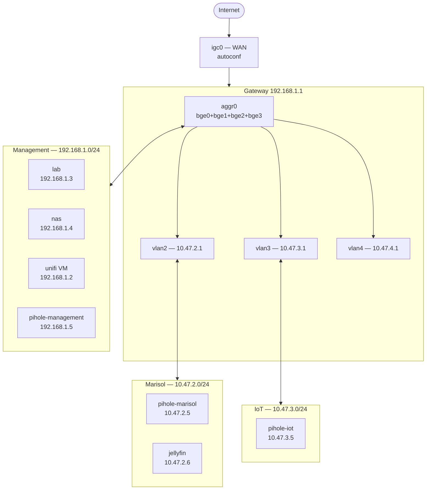
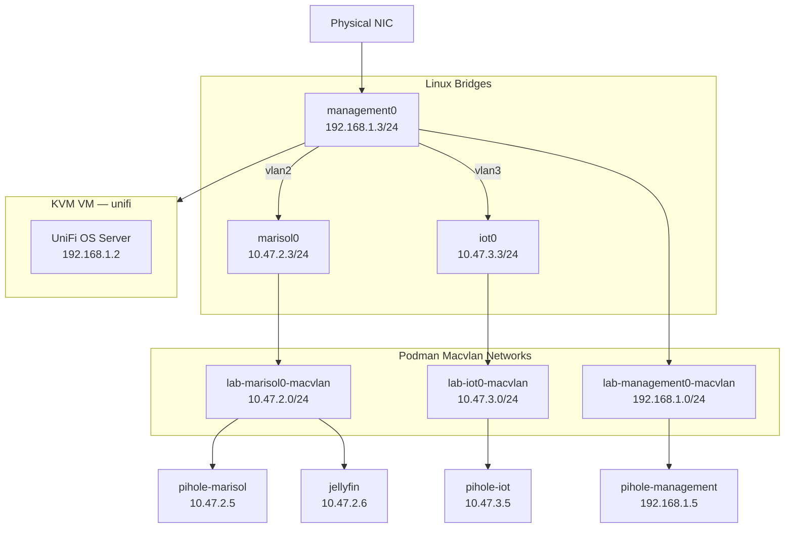
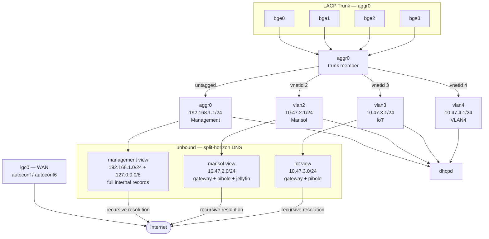

# lab

Ansible automation for a home lab network.

## Hosts

| Host | IP | OS | Role |
|------|----|----|------|
| lab | 192.168.1.3 | Fedora 43 | Primary server — containers, VMs, NFS client |
| gateway | 192.168.1.1 | OpenBSD | Router — DHCP, DNS, firewall |
| unifi | 192.168.1.2 | Ubuntu 24.04 VM | UniFi OS Server |

## Networks

| Network | Subnet | Purpose |
|---------|--------|---------|
| management | 192.168.1.0/24 | Primary LAN |
| marisol | 10.47.2.0/24 | Guest/media VLAN |
| iot | 10.47.3.0/24 | IoT VLAN |

### Network Overview



### Lab Server — Network Configuration



### Gateway — Network & Services



## Prerequisites

- Ansible with `community.general` collection
- A vault password for encrypted secrets
- SSH access to all hosts

## Usage

```bash
# Run full configuration
ansible-playbook lab.yml --ask-vault-pass
ansible-playbook gateway.yml --ask-vault-pass

# Run a single role
ansible-playbook lab.yml --tags <role> --ask-vault-pass

# Dry run
ansible-playbook lab.yml --check --ask-vault-pass
```

Available tags match role names: `system-setup`, `user-setup`, `bridge-networking`, `podman`, `podman-macvlan`, `pihole`, `nfs-media`, `va-api`, `jellyfin`, `virtualization`, `unifi`, `gateway-network`, `dhcpd`, `unbound`.

## Secrets

Secrets are managed with ansible-vault:

```bash
# Edit vault
ansible-vault edit group_vars/lab/vault.yml

# Encrypt a new file
ansible-vault encrypt roles/<role>/files/<file>.key
```

## Services

| Service | Host | IP |
|---------|------|----|
| PiHole (management) | lab | 192.168.1.5 |
| PiHole (marisol) | lab | 10.47.2.5 |
| PiHole (iot) | lab | 10.47.3.5 |
| Jellyfin | lab | 10.47.2.6 |
| UniFi OS Server | unifi | 192.168.1.2 |
